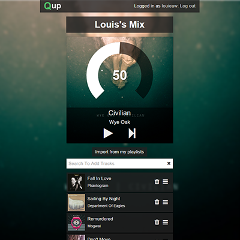
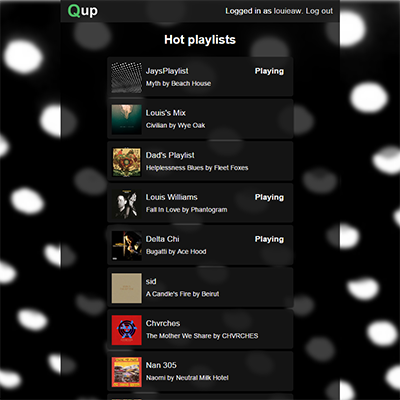

QueueUp Server
===========

QueueUp is a collaborative playlist streaming service. Anybody can create a playlist, use Spotify to stream from QueueUp, and invite friends to contribute in real time.

A QueueUp *Player* is requried to stream from QueueUp. This repository is for the QueueUp *Server*. Read below about *Players*.

Live site
---
 - [q.louiswilliams.org](http://q.louiswilliams.org) (Any of [q,qup,queueup] subdomains will work)

Setup
-------
The `/spotify.key` configuration file is required to run the server  properly. An example configuration file is located in `/spotify.key.example`. All of the requried parameters can be obtained by creating Spotify Developer account, and then a [Spotify Application](https://developer.spotify.com/my-applications).

A MongoDB Server should be running on `localhost:27017`. This is configurable in `server.js`.

Install & Run
-------------
`npm install`

`npm start`

API
---
The Server API is still in development, but has the following functions, which return JSON Objects.
 - GET `/api/playlists`: Get a list of playlists.
    - *[Playlist]*: Array of *Playlist* objects. See *Objects*.
 - GET `/api/playlists/:id`: Get details for a playlist, by Playlist._id.
    - *Playlist*: Playlist object. See *Objects*.

Players
=======================

A QueueUp Player is required to play from [QueueUp](http://qup.louiswilliams.org). It connects to the server, subscribes to a playlist, and updates automatically to play music from a playlist.

Available Players:
  - [Android Player](https://github.com/extrakt/queueup-player-android): An ready-to-run AndroidStudio project.
  - [Node.js Player](https://github.com/extrakt/queueup-spotify-client): Requires some setup, but effectively the same as the Android player, just on a desktop platform.
  - [iOS](https://github.com/reynoldsjay/queueup-player-ios): XCode project with iPhone player.

Notes:
  - All players require Spotify Premium accounts. This is a result of music licensing contracts, and there is no way around it. Consider buying one. As a student ($5/mo), it is one of the best decisions I've made in my adult life.
  - No web streaming API exists, again, because of music licensing issues with Spotify. Currently, the streaming APIs are limited to Android, iOS, and C (personal use developer accounts only).

Implementation
-------------

The player API is controlled by the server through Socket.io connections. Below are the Socket.io events to fully implement the QueueUp Player and subscribe to updates. There are Socket.IO ports from Javascript to most popular languages.

Connection/Subscription
----------
The playlist subscription process happens in this order:

1. Socket#connect `http://queueup.louiswilliams.org` *Connect to Queueup or your own server*.
2. Socket#on `auth_request` *Server is requesting a playlist ID*  
3. Socket#emit `auth_send`: `{id: [playlist_id]}` *Send back the ID of the playlist to play. See* API *for getting an ID*  
  3.1. Socket#on `auth_success` *You are now subscribed to udpates from the playlist*  
  3.2. Socket#on `auth_fail` *A problem occured subscribing to the playlist*

Playlist Updates
----------------
Any of the following Socket.io events may happen:
 - `disconnect`: The server has disconnected. You will no longer receive updates unless either you manually reconnect,  or Socket.io does so automatically.
 - `state_change`: The server has sent you a State object in the JSON format. See *State* object below.

Objects
=======
- *Playlist*: Playlist object that represents the entire playlist. Only used in the web API.
    -  `_id` *String*: Internal ID. Used for Player authentication. See *Players: Connection/Subscription*.
    -  `name` *String* Name of the playlist
    -  `current` *Track*: Currently playing Track
    -  `play` *Boolean*: `true` if playing, `false` otherwise
    -  `volume` *Number [0-100]*: Volume percentage
    -  `tracks` *[QueueItem]*:  Ordered items in the queue.
    -  `admin` Interal ID associate with the Adminisator user (creator)
    -  `date_created` *Number*: Date created (UNIX)
    -  `last_updated` *Number*: Date last updated (UNIX)
    -  `key` *String*: Non-unique short name for the playlist

- *State*: (Note: all fields are *optionally* sent). Generally speaking, only the changed fields are sent, but that is not always the case.
   - `[volume]` *Number [0-100]*: Percent volume
   - `[play]` *Boolean*: `true` if playing, `false` otherwise
   - `[track]` *Track*: Currently playing track.
   - `[queue]` *[QueueItem]*: Ordered Array of *QueueItem*s.
   - `[trigger]` *String*: Mostly for debugging. Identifies what action caused this broadcast.
- *Track*: Simplified version of [Spotify's Track (full)](https://developer.spotify.com/web-api/object-model/#track-object-full).
    -  `name` *String*: Track name
    -  `id` *String*: Spotify ID
    -  `uri` *String*: Spotify URI
    -  `artists` *[Object]*: Array of Spotify's Artist objects
        -  `id` *String*: Spotify ID
        -  `name` *String*: Artist name
        -  `type` *String*: Artist type
        -  `uri` *String*: Spotify URI
        -  `href` *String*: Spotify URLs
        -  `external_urls` *[String]*: Extra URLs
    -  `album` *Object*: Spotify's Album object
        - `id` *String*: Spotify ID
        - `name` *String*: Album name
        - `uri` *String*: Spotify URI
        - `images` *[Object]*: Array of Images
            - `height`: *Number*: Image height
            - `width`: *Number*: Image width
            - `url`: *String*: Image URL
- *QueueItem*: Item in the queue
    - `_id`: *String*: Internal ID
    - `track`: *[Track]*: Array of *Track* objects

Remarks
-------
Because I only get to spend so much of my time on this, I am opening this project up to contribution.

If there is a feature you want to see, you have a problem with the app, or you have a problem with me, send me message or open an Issue, thanks!
